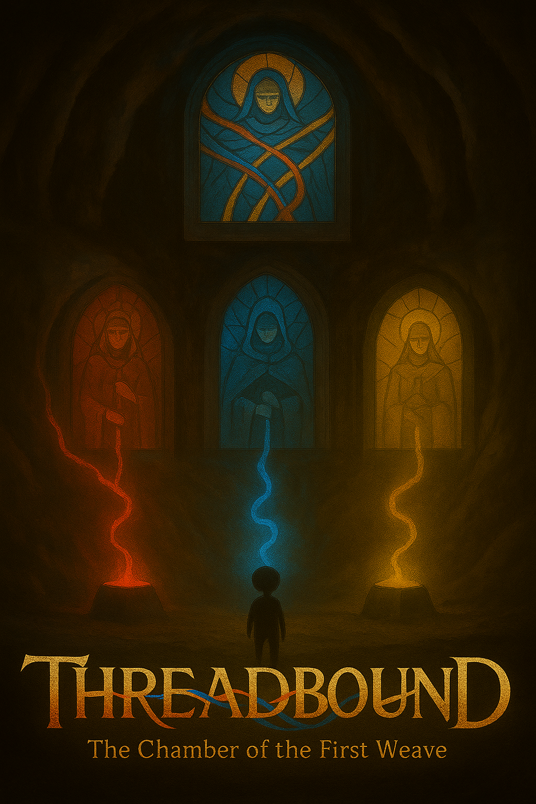
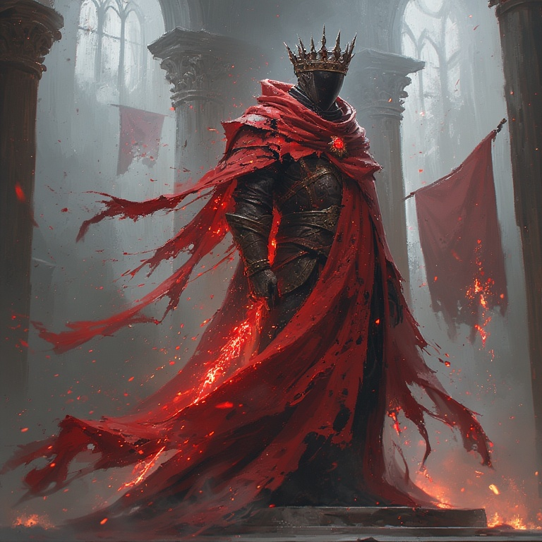

# Threadbound 🧵

**A painterly 2D Metroidvania about threads, destiny, and the freedom to choose.**

> “In 
> the beginning, all things were woven. Every life, every choice, a thread in the Grand Tapestry.”

When the Weaver shattered the loom of creation, the world’s fate unraveled.  
From the fragments fell one final thread — and became **you**, the Threadborne.

### Core Pillars
- Three primordial threads: Red (Power) · Blue (Balance) · Yellow (Essence)
- Nonlinear Metroidvania exploration
- Choice-driven progression: spare or absorb the three Thread Masters
- 8+ endings ranging from restoration to total destruction
- Subtle Christian themes of creation, rebellion, and redemption

### Quick Look

### Status
Early prototype in Godot 4 · Solo dev (Chase King) · Actively looking for collaborators!

Full documentation → [/docs](docs/)

MIT License · Made with love ☕