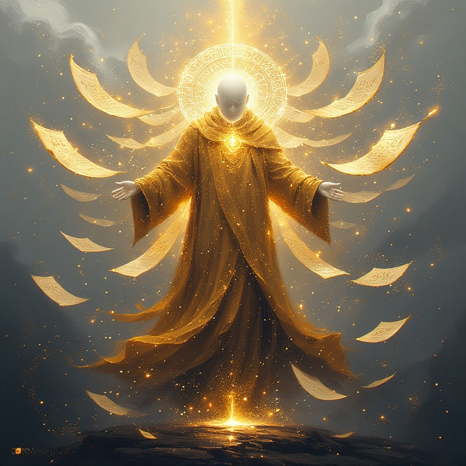

<<<<<<< HEAD
# Threadbound 🧵

© 2025 Chase King (ChaseKing77). All rights reserved for art, design, and story.  
Code is MIT-licensed (see LICENSE). Feel free to fork/learn from it, but please don’t make commercial clones without asking!

**A painterly 2D Metroidvania about threads, destiny, and the freedom to choose.**

> “In 
> the beginning, all things were woven. Every life, every choice, a thread in the Grand Tapestry.”

When the Weaver shattered the loom of creation, the world’s fate unraveled.  
From the fragments fell one final thread — and became **you**, the Threadborne.

### Core Pillars
- Three primordial threads: Red (Power) · Blue (Balance) · Yellow (Essence)
- Nonlinear Metroidvania exploration
- Choice-driven progression: spare or absorb the three Thread Masters
- 8+ endings ranging from restoration to total destruction
- Subtle Christian themes of creation, rebellion, and redemption

### Quick Look - Bosses (Sage, Monarch, Hermit)

### Status
Early prototype in Godot 4 · Solo dev (Chase King) · Actively looking for collaborators!

Full documentation → [/docs](docs/)

MIT License · Made with love ☕
=======
🧵 Thread Bound

A painterly 2D Metroidvania about threads, destiny, and the freedom to choose.

📸 Screenshots / Art Direction (optional)

(We can add images later — no rush)

🎮 About the Game

Thread Bound is a 2D Metroidvania built in Godot. The world is centered around weaving, fate, and choice.
Players explore a world of cloth, thread, and living looms, gaining abilities tied to color archetypes:

Red – Power, destructive abilities

Blue – Balance, connection, traversal

Yellow – Essence, environmental manipulation

✨ Current Status

Early prototype

Worldbuilding foundations complete

Basic character controller in progress

Recruiting collaborators (art, dev, music, VFX)

🛠 Tech Stack

Engine: Godot 4.x

Language: GDScript

Art style: Painterly (inspired by Hollow Knight but brighter)

Version control: Git + GitHub
>>>>>>> 5849d5659ee4a63163021e90ee0b59a2945db086
